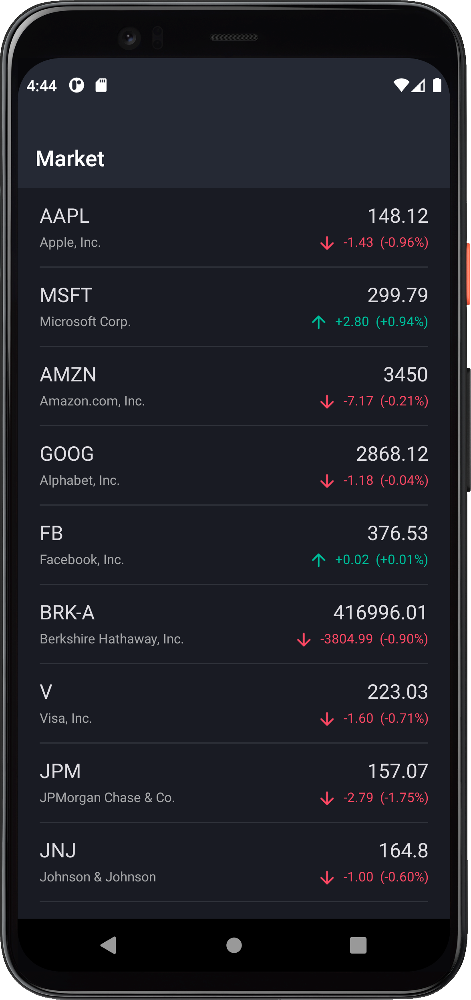
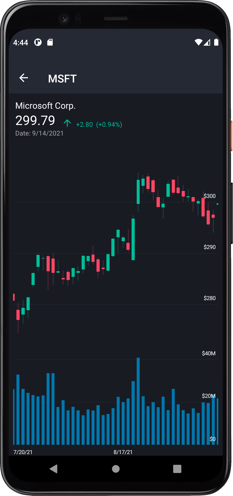

<!-- default badges list -->
[](https://docs.devexpress.com/GeneralInformation/403183)
<!-- default badges end -->
# Stocks App for .NET MAUI

This repository contains a sample application that displays companies listed on NASDAQ and historical quotes on stocks over the past three months. The app consists of two screens. On the main screen, the application uses the [DevExpress Collection View for .NET MAUI](https://docs.devexpress.com/MAUI/403324/collection-view/index) to display a list of symbols.

 

On the second screen, the [DevExpress Chart View for .NET MAUI](https://docs.devexpress.com/MAUI/403300/charts/charts) displays historical data &mdash; daily open-close-high-low stock prices and volumes.

 

These and other DevExpress components for mobile development are available free of charge. See the following topic for more information: [Free DevExpress Controls for .NET Multi-platform App UI (.NET MAUI)](https://docs.devexpress.com/MAUI/403245/maui).

## Prerequisites

1. Install Visual Studio 2022 and the latest .NET MAUI version. See the following topic on docs.microsoft.com for more information: [Installation](https://docs.microsoft.com/en-gb/dotnet/maui/get-started/installation).
1. Register the following NuGet feed in Visual Studio:
    ```
    https://nuget.devexpress.com/free/api
    ```
    > If you are an active [DevExpress Universal](https://www.devexpress.com/subscriptions/universal.xml) customer, DevExpress Controls for .NET MAUI are available in your [personal NuGet feed](https://nuget.devexpress.com/).
    
    See the following topic on docs.microsoft.com for more information on how to register a NuGet source: [Install and manage packages in Visual Studio](https://docs.microsoft.com/en-us/nuget/consume-packages/install-use-packages-visual-studio#package-sources).


## How to Create This Application

The step-by-step instructions below describe how to create an application similar to the application in this repository.

### Create a New Project

1. In Visual Studio 2022, create a new .NET MAUI project. Name it *Stocks*. See the following topic on docs.microsoft.com for more information on how to create a new .NET MAUI project: [Build your first app](https://docs.microsoft.com/en-gb/dotnet/maui/get-started/first-app).
    > You can also call the following command in a CLI to create a new .NET MAUI project:
    > ```
    > dotnet new maui -n Stocks 
    > ```
1. Install the following packages from the **https://nuget.devexpress.com/free/api** NuGet package source:
    * **DevExpress.Maui.CollectionView**&mdash;contains the [DXCollectionView](https://docs.devexpress.com/MAUI/DevExpress.Maui.CollectionView.DXCollectionView) component.
    * **DevExpress.Maui.Charts**&mdash;contains the [ChartView](https://docs.devexpress.com/MAUI/DevExpress.Maui.Charts.ChartView) component.

> DevExpress Collection View and Charts for .NET MAUI support iOS and Android. The project should only contain these platforms. If the wizard included MacCatalyst and/or Windows platforms in the project, remove them. Right-click the project, go to the project properties, and remove `net6.0-maccatalyst` from the list of target frameworks. Also, remove the **MacCatalyst** and **Windows** folders from the **Platforms** folder in the Solution Explorer.

### The Main Page

The main page displays a list of companies. In the *MainPage.xaml* file, do the following:

1. Define the **dxcv** XAML namespace that refers to the **DevExpress.Maui.CollectionView** CLR namespace.
1. Remove the default content and add an instance of the [DXCollectionView](https://docs.devexpress.com/MAUI/DevExpress.Maui.CollectionView.DXCollectionView) class to the page. Remove the default content's event handlers in the code-behind. We recommend that you remove the default styles (fonts, colors, and other settings) in the *App.xaml* file.

```xaml
<ContentPage
    xmlns="http://schemas.microsoft.com/dotnet/2021/maui"
    xmlns:x="http://schemas.microsoft.com/winfx/2009/xaml"
    xmlns:d="http://schemas.microsoft.com/dotnet/2021/maui/design"
    xmlns:dxcv="clr-namespace:DevExpress.Maui.CollectionView;assembly=DevExpress.Maui.CollectionView"
    xmlns:local="clr-namespace:Stocks"
    x:Class="Stocks.MainPage">
    <dxcv:DXCollectionView/>
</ContentPage>
```

#### Register Handlers for the Chart and Collection Views

The .NET MAUI framework requires a registered handler for any third-party control you use in the application. See the following topic on docs.microsoft.com for more information: [Register handlers](https://docs.microsoft.com/en-us/dotnet/maui/fundamentals/app-startup#register-handlers).

In the *MauiProgram.cs* file, register a handler for the [DXCollectionView](https://docs.devexpress.com/MAUI/DevExpress.Maui.CollectionView.DXCollectionView) type as shown below. As we use a chart on the second page, we also register a handler for the [ChartView](https://docs.devexpress.com/MAUI/DevExpress.Maui.Charts.ChartView) type.

```cs
using DevExpress.Maui.CollectionView;
using DevExpress.Maui.Charts;
using Microsoft.Maui;
using Microsoft.Maui.Hosting;
using Microsoft.Maui.Controls.Hosting;
using Microsoft.Maui.Controls.Xaml;

[assembly: XamlCompilationAttribute(XamlCompilationOptions.Compile)]

namespace Stocks {
    public static class MauiProgram {
        public static MauiApp CreateMauiApp() {
            var builder = MauiApp.CreateBuilder();
            builder
                .UseMauiApp<App>()
                .ConfigureMauiHandlers((handlers) => 
                    handlers.AddHandler(typeof(IDXCollectionView), typeof(DXCollectionViewHandler)))
                .ConfigureMauiHandlers((handlers) => 
                    handlers.AddHandler(typeof(ChartView), typeof(ChartViewHandler)))
                .ConfigureFonts(fonts => fonts.AddFont("OpenSans-Regular.ttf", "OpenSansRegular"));
            return builder.Build();
        }
    }
}
```

### Data Source

If we now run the application, it displays an empty collection view on the main page. Let's populate it with data. This application follows the [MVVM](https://en.wikipedia.org/wiki/Model%E2%80%93view%E2%80%93viewmodel) pattern. To store data, the application uses the following classes:

* **Symbol**&mdash;contains a company name, ticker, and a collection of daily historical data.
* **StockPrice**&mdash;contains the open-close-high-low prices and volume in a single day.

Create a new class in the project and paste the following code:

```cs
using System;
using System.Collections.Generic;

namespace Stocks {
    public class Symbol {
        public string Ticker { get; set; }
        public string Name { get; set; }
        public IList<StockPrice> Prices {  get; set; }
    }
    public class StockPrice {
        public DateTime Date { get; set; }
        public double Open { get; set; }
        public double Close { get; set; }
        public double High { get; set; }
        public double Low { get; set; }
        public double Volume { get; set; }
    }
}
```

#### Populate the Data Source

A mobile application typically uses a [REST](https://en.wikipedia.org/wiki/Representational_state_transfer) API to obtain data from a web service. The response can be formatted in HTML, XML, JSON, or any other format. This sample application uses static data formatted in [JSON](https://en.wikipedia.org/wiki/JSON) and stored in a file. The JSON file contains an array of companies each of which contains an array of daily historical stock prices.

Download the [symbols.json](./MauiStocksMini/Data/symbols.json) file, and add this file to the solution. Then right-click the file, go to properties, and set **Build Action** to **Embedded resource**.


Use the code below to read data from the file and populate the data source. Create a new class in the project as follows:

```cs
using System.Collections.Generic;
using System.IO;
using System.Reflection;
using System.Text;

namespace Stocks {
    public static class Data {
        static readonly string logicalName = "symbols";

        static IList<Symbol> symbols;
        public static IList<Symbol> Symbols {
            get {
                if (symbols == null) {
                    symbols = GetSymbols();
                }
                return symbols;
            }
        }

        static IList<Symbol> GetSymbols() {
            List<Symbol> symbols = null;
            using (Stream stream = Assembly.GetExecutingAssembly().GetManifestResourceStream(logicalName))
            using (StreamReader reader = new(stream, Encoding.UTF8)) {
                var json = reader.ReadToEnd();
                symbols = Newtonsoft.Json.JsonConvert.DeserializeObject<List<Symbol>>(json);
            }
            return symbols;
        }
    }
}
```

> You should install the [Newtonsoft.Json](https://www.nuget.org/packages/Newtonsoft.Json/) package to deserialize data. See the following topic on docs.microsoft.com for more information: [Install and use a package in Visual Studio](https://docs.microsoft.com/en-us/nuget/quickstart/install-and-use-a-package-in-visual-studio).

#### The Main View Model

Now let's create a view model for the main page. As the data source contains an array of daily stock prices, we can display the price change next to each company in the list. The code below defines the following view models:

* **ItemViewModel**&mdash;a view model for an item in the view. It contains the company name, close stock price, price change, and change percentage.
* **MainViewModel**&mdash;a view model for the main page. It contains a collection of item view models. When the main view model is created, it populates the item collection with data.

```cs
using System;
using System.Collections.Generic;

namespace Stocks {
    public class MainViewModel {
        public IList<ItemViewModel> Items { get; set; }

        public MainViewModel() {
            Items = new List<ItemViewModel>();
            foreach (Symbol symbol in Data.Symbols) {
                var symbolViewModel = new ItemViewModel();
                symbolViewModel.Ticker = symbol.Ticker;
                symbolViewModel.CompanyName = symbol.Name;
                symbolViewModel.Change = symbol.Prices[0].Close - symbol.Prices[1].Close;
                symbolViewModel.ChangePercent = symbol.Prices[0].Close / symbol.Prices[1].Close - 1;
                symbolViewModel.Date = symbol.Prices[0].Date;
                symbolViewModel.ClosePrice = symbol.Prices[0].Close;
                Items.Add(symbolViewModel);
            }
        }
    }

    public class ItemViewModel {
        public string Ticker { get; set; }
        public string CompanyName { get; set; }
        public double ClosePrice { get; set; }
        public double Change { get; set; }
        public double ChangePercent { get; set; }
        public DateTime Date { get; set; }
    }
}
```

#### Update the Main Page Markup

Now we can update the main page markup so it displays data from the view model. We set the **ContentPage.BindingContext** property to a view model object and bind the [DXCollectionView.ItemsSource](https://docs.devexpress.com/MAUI/DevExpress.Maui.CollectionView.DXCollectionView.ItemsSource) property to a collection in this view model.

```xaml
<ContentPage.BindingContext>
    <local:MainViewModel/>
</ContentPage.BindingContext>
<ContentPage.Content>
    <dxcv:DXCollectionView
        ItemsSource="{Binding Items}">
    </dxcv:DXCollectionView>
</ContentPage.Content>
```

##### Item Template

The [DXCollectionView.ItemTemplate](https://docs.devexpress.com/MAUI/DevExpress.Maui.CollectionView.DXCollectionView.ItemTemplate) property allows you to specify a data template used to render items in the view. In this example, the template contains multiple labels and an image. See the following topic on docs.microsoft.com for more information on data templates: [Creating a Data Template](https://docs.microsoft.com/en-us/xamarin/xamarin-forms/app-fundamentals/templates/data-templates/creating).

Let's create a grid layout in the item template.

```xaml
<dxcv:DXCollectionView.ItemTemplate>
    <DataTemplate>
        <Grid
            Margin="0"
            BackgroundColor="Transparent"
            RowSpacing="0"
            ColumnSpacing="0"
            Padding="8,0">
            <Grid.ColumnDefinitions>
                <ColumnDefinitionCollection>
                    <ColumnDefinition Width="Auto"/>
                    <ColumnDefinition Width="*"/>
                    <ColumnDefinition Width="Auto"/>
                    <ColumnDefinition Width="Auto"/>
                </ColumnDefinitionCollection>
            </Grid.ColumnDefinitions>
            <Grid.RowDefinitions>
                <RowDefinitionCollection>
                    <RowDefinition Height="Auto"/>
                    <RowDefinition Height="Auto"/>
                    <RowDefinition Height="1"/>
                </RowDefinitionCollection>
            </Grid.RowDefinitions>
        </Grid>
    </DataTemplate>
</dxcv:DXCollectionView.ItemTemplate>
```

Then we populate the grid layout with labels and images.

```xaml
<Label
    Text="{Binding Ticker}"
    Grid.Column="1"
    Margin="12,12,0,0"
    VerticalOptions="End"
    TextColor="{DynamicResource PrimaryTextColor}"
    FontSize="Medium"/>
<Label
    Text="{Binding CompanyName}"
    Grid.Row="1"
    Grid.Column="1"
    Margin="12,4,0,12"
    VerticalOptions="Start"
    FontSize="Caption"
    TextColor="{DynamicResource SecondaryTextColor}"/>
<Label
    Text="{Binding ClosePrice}"
    Grid.Column="2"
    Grid.ColumnSpan="2"
    VerticalOptions="End"
    Margin="0,12,12,0"
    HorizontalOptions="End"
    FontSize="Medium"
    TextColor="{DynamicResource PrimaryTextColor}"/>
<StackLayout
    Orientation="Horizontal"
    Grid.Column="2"
    Grid.Row="1"
    VerticalOptions="Start"
    Margin="0,4,12,12">
    <Image
        Source="{Binding Change, Converter={local:DoubleToImageSourceConverter
            PositiveValue='quote_arrow_up.svg',
            NegativeValue='quote_arrow_down.svg',
            ZeroValue='not_changed.svg'}}"
        WidthRequest="18"
        HeightRequest="18"
        HorizontalOptions="End"
        VerticalOptions="Start"
        Margin="0,0,3,0"/>
    <Label
        Text="{Binding Change, StringFormat='{0:n2}'}"
        TextColor="{Binding Change, Converter={local:DoubleToColorConverter
            PositiveValue='RisingValueColor',
            NegativeValue='FallingValueColor',
            ZeroValue='TextColor'}}"
        HorizontalOptions="End"
        VerticalOptions="Start"
        FontSize="Caption"
        Margin="3,0"/>
    <Label
        Text="{Binding ChangePercent, StringFormat='{0:p2}'}"
        TextColor="{Binding Change, Converter={local:DoubleToColorConverter
            PositiveValue='RisingValueColor', 
            NegativeValue='FallingValueColor', 
            ZeroValue='TextColor'}}"
        HorizontalOptions="End"
        VerticalOptions="Start"
        Margin="3,0,0,0"
        FontSize="Caption"/>
</StackLayout>
<BoxView
    Grid.Row="2"
    Grid.ColumnSpan="4"
    Color="{DynamicResource SeparatorColor}"
    Margin="12,0"/>
```

##### Value Converters

As you may notice, the markup uses a converter to display an up or down arrow depending on whether the price is increased or decreased. You can find image files in the [Images](./MauiStocksMini/Resources/Images) folder. The text color also depends on the change. To learn more about converters, see the following topic on docs.microsoft.com: [Binding Value Converters](https://docs.microsoft.com/en-us/xamarin/xamarin-forms/app-fundamentals/data-binding/converters).

```cs
using Microsoft.Maui.Controls;
using Microsoft.Maui.Controls.Xaml;
using Microsoft.Maui.Graphics;
using System.Globalization;

namespace DevExpress.Maui.Demo.Stocks {
    public class DoubleToImageSourceConverter : IValueConverter, IMarkupExtension<DoubleToImageSourceConverter> {
        public ImageSource ZeroValue { get; set; } = string.Empty;
        public ImageSource PositiveValue { get; set; } = string.Empty;
        public ImageSource NegativeValue { get; set; } = string.Empty;
        public object Convert(object value, Type targetType, object parameter, CultureInfo culture) {
            if (!(value is double doubleValue) || targetType != typeof(ImageSource)) return null;
            switch (doubleValue) {
                case > 0: return PositiveValue;
                case < 0: return NegativeValue;
                default: return ZeroValue;
            }
        }
        public object ConvertBack(object value, Type targetType, object parameter, CultureInfo culture) {
            throw new NotSupportedException();
        }

        public object ProvideValue(IServiceProvider serviceProvider) {
            return this;
        }

        DoubleToImageSourceConverter IMarkupExtension<DoubleToImageSourceConverter>.ProvideValue(IServiceProvider serviceProvider) {
            return this;
        }
    }

    public class DoubleToColorConverter : IValueConverter, IMarkupExtension<DoubleToColorConverter>{
        public string ZeroValue { get; set; } = string.Empty;
        public string PositiveValue { get; set; } = string.Empty;
        public string NegativeValue { get; set; } = string.Empty;
        public object Convert(object value, Type targetType, object parameter, CultureInfo culture) {
            if (!(value is double doubleValue) || targetType != typeof(Color)) return null;
            switch (doubleValue) {
                case > 0: return (Color)Application.Current.Resources[PositiveValue];
                case < 0: return (Color)Application.Current.Resources[NegativeValue];
                default: return (Color)Application.Current.Resources[ZeroValue];
            }
        }
        public object ConvertBack(object value, Type targetType, object parameter, CultureInfo culture) {
            throw new NotSupportedException();
        }

        public DoubleToColorConverter ProvideValue(IServiceProvider serviceProvider) {
            return this;
        }

        object IMarkupExtension.ProvideValue(IServiceProvider serviceProvider) {
            return this;
        }
    }
}
```


##### Theme

The application applies a dark theme to controls. You can find colors and styles in the [DarkTheme.xaml](./MauiStocksMini/Themes/DarkTheme.xaml) and [SharedStyles.xaml](./MauiStocksMini/Themes/SharedStyles.xaml) files of this repository.

#### Run the Application

You can now run the application. The main page displays a list of companies.

 

### The Historical Data Page

The second page displays historical data in a chart. Create a new page in Visual Studio and name it *HistoricalDataPage*. Do the following in the markup:
1. Define the **dxc** XAML namespace that refers to the **DevExpress.Maui.Charts** CLR namespace.
1. Add an instance of the [ChartView](https://docs.devexpress.com/MAUI/DevExpress.Maui.Charts.ChartView) class to the page.

```xaml
<ContentPage
    xmlns="http://schemas.microsoft.com/dotnet/2021/maui"
    xmlns:x="http://schemas.microsoft.com/winfx/2009/xaml"
    xmlns:dxc="clr-namespace:DevExpress.Maui.Charts;assembly=DevExpress.Maui.Charts"
    xmlns:local="clr-namespace:Stocks"
    x:Class="Stocks.HistoricalDataPage">
    <dxc:ChartView/>
</ContentPage>
```

#### Populate the Chart with Data

Let's create a view model for this page and populate it with data. The code below defines the **HistoricalDataViewModel** class that exposes the following properties:

* **StockPrices**&mdash;daily open-close-high-low stock prices.
* **RangeStart** and **RangeEnd**&mdash;specify the visible date range in the chart. The chart displays data for the last 60 days. A user can scroll the chart to see the rest of the available historical prices.

```cs
using System;
using System.Collections.Generic;
using System.Linq;

namespace Stocks {
    public class HistoricalDataViewModel {
        public ItemViewModel Item { get; set; }
        public IList<StockPrice> StockPrices { get; set; }
        public DateTime RangeStart { get; set; }
        public DateTime RangeEnd { get; set; }

        public HistoricalDataViewModel(ItemViewModel item) {
            Item = item;
            Symbol symbol = Data.Symbols.Where(s => s.Ticker == this.Item.Ticker).First();
            RangeStart = symbol.Prices.First().Date;
            RangeEnd = RangeStart.AddDays(-60);
            StockPrices = new List<StockPrice>();
            foreach(StockPrice price in symbol.Prices) {
                StockPrices.Add(price);
            }
        }
    }
}
```

#### Update the Historical Data Page Markup

Now we can update the historical data page so it displays data from the view model. We set the **ContentPage.BindingContext** property to a view model object in the page constructor.

```cs
using Microsoft.Maui.Controls;

namespace Stocks {
    public partial class HistoricalDataPage : ContentPage {
        public HistoricalDataPage(HistoricalDataViewModel viewModel) {
            InitializeComponent();
            BindingContext = viewModel;
            Title = viewModel.Item.Ticker;
        }
    }
}
```

At the top of the page, the app displays the company name and the last price. Below the company name, the app displays the chart. We place these elements in a grid layout. 

```xaml
<Grid>
    <Grid.RowDefinitions>
        <RowDefinition Height="115"/>
        <RowDefinition Height="*"/>
    </Grid.RowDefinitions>
</Grid>
```

The first grid row contains the company name and the last price. We use labels and images to display this information.

```xaml
<StackLayout
    Grid.Row="0" Grid.Column="0"
    BackgroundColor="Transparent"
    Orientation="Vertical"
    HorizontalOptions="StartAndExpand"
    VerticalOptions="CenterAndExpand"
    Spacing="0"
    Margin="12">
    <Label
        Text="{Binding Item.CompanyName}"
        TextColor="{DynamicResource TextColor}"
        FontSize="Subtitle"
        Margin="0,0,12,0"/>
    <StackLayout
        Orientation="Horizontal"
        Spacing="0"
        HorizontalOptions="StartAndExpand">
        <Label
            Text="{Binding Item.ClosePrice, StringFormat='{0:0.00}'}"
            TextColor="{DynamicResource TextColor}"
            FontSize="Title"
            Margin="0,0,12,0"
            VerticalOptions="End"
            VerticalTextAlignment="End"
            LineBreakMode="TailTruncation"/>
        <Image
            WidthRequest="18"
            HeightRequest="18"
            HorizontalOptions="End"
            Margin="0,0,3,0"
            Source="{Binding Item.Change, 
            Converter={local:DoubleToImageSourceConverter
                PositiveValue='quote_arrow_up.svg', 
                NegativeValue='quote_arrow_down.svg',
                ZeroValue='not_changed.svg'}}"
            VerticalOptions="End">
            <Image.WidthRequest>
                <OnPlatform x:TypeArguments="x:Double">
                    <On Platform="Android" Value="20"/>
                    <On Platform="iOS" Value="24"/>
                </OnPlatform>
            </Image.WidthRequest>
            <Image.HeightRequest>
                <OnPlatform x:TypeArguments="x:Double">
                    <On Platform="Android" Value="20"/>
                    <On Platform="iOS" Value="24"/>
                </OnPlatform>
            </Image.HeightRequest>
        </Image>
        <Label
            Text="{Binding Item.Change, StringFormat='{0:+0.00;-0.00;0.00}'}"
            TextColor="{Binding Item.Change, 
            Converter={local:DoubleToColorConverter
                PositiveValue='RisingValueColor', 
                NegativeValue='FallingValueColor', 
                ZeroValue='TextColor'}}"
            HorizontalOptions="End"
            VerticalOptions="End"
            FontSize="Caption"
            Margin="3,0"/>
        <Label
            Text="{Binding Item.ChangePercent, StringFormat='{0:(+0.00%);(-0.00%);(0.00%)}'}"
            TextColor="{Binding Item.Change, 
            Converter={local:DoubleToColorConverter
                PositiveValue='RisingValueColor', 
                NegativeValue='FallingValueColor', 
                ZeroValue='TextColor'}}"
            HorizontalOptions="End"
            VerticalOptions="End"
            Margin="3,0,0,0"
            FontSize="Caption"/>
    </StackLayout>
    <Label
        Text="{Binding Item.Date, StringFormat='Date: {0:d}'}"
        TextColor="{DynamicResource SecondaryTextColor}"
        FontSize="Caption"/>
</StackLayout>
```

In the second grid row, we place the chart.

```xaml
<dxc:ChartView
    Theme="Dark"
    Grid.Row="1"
    AxisXNavigationMode="ScrollingAndZooming"
    AxisMaxZoomPercent="100000">
    <dxc:ChartView.ChartStyle>
        <dxc:ChartStyle
            BackgroundColor="{StaticResource BackgroundColor}">
            <dxc:ChartStyle.Padding>
                <dxc:Padding Left="8" Right="8"/>
            </dxc:ChartStyle.Padding>
        </dxc:ChartStyle>
    </dxc:ChartView.ChartStyle>
</dxc:ChartView>
```

##### Axes

The [ChartView.AxisX](https://docs.devexpress.com/MAUI/DevExpress.Maui.Charts.ChartView.AxisX) and [ChartView.AxisY](https://docs.devexpress.com/MAUI/DevExpress.Maui.Charts.ChartView.AxisY) properties allow you to specify the chart axes:

* [DateTimeAxisX.MeasureUnit](https://docs.devexpress.com/MAUI/DevExpress.Maui.Charts.DateTimeAxisX.MeasureUnit)&mdash;specifies the detail level for date-time values.
* [DateTimeAxisX.Range](https://docs.devexpress.com/MAUI/DevExpress.Maui.Charts.DateTimeAxisX.Range)&mdash;specifies the date range. We bind these settings to properties in the view model.
* [NumericAxisY.AutoRangeMode](https://docs.devexpress.com/MAUI/DevExpress.Maui.Charts.NumericAxisY.AutoRangeMode)&mdash;specifies whether the value range is calculated based on all or visible values.
* [NumericAxisY.Label](https://docs.devexpress.com/MAUI/DevExpress.Maui.Charts.AxisBase.Label)&mdash;specifies the label position and string format.
* [NumericAxisY.Style](https://docs.devexpress.com/MAUI/DevExpress.Maui.Charts.AxisBase.Style)&mdash;specifies grid line visibility and colors.

```xaml
<dxc:ChartView.AxisX>
    <dxc:DateTimeAxisX
        x:Name="axisX"
        EmptyRangesVisible="False"
        MeasureUnit="Day">
        <dxc:DateTimeAxisX.Range>
            <dxc:DateTimeRange
                SideMargin="3"
                VisualMin="{Binding RangeStart}"
                VisualMax="{Binding RangeEnd}"/>
        </dxc:DateTimeAxisX.Range>
    </dxc:DateTimeAxisX>
</dxc:ChartView.AxisX>
<dxc:ChartView.AxisY>
    <dxc:NumericAxisY
        AlwaysShowZeroLevel="False"
        AutoRangeMode="VisibleValues">
        <dxc:NumericAxisY.DisplayPosition>
            <dxc:AxisDisplayPositionFar/>
        </dxc:NumericAxisY.DisplayPosition>
        <dxc:NumericAxisY.Layout>
            <dxc:AxisLayout Anchor1="0.333" Anchor2="1.0" />
        </dxc:NumericAxisY.Layout>
        <dxc:NumericAxisY.Label>
            <dxc:AxisLabel Position="Inside" TextFormat="$#.#"/>
        </dxc:NumericAxisY.Label>
        <dxc:NumericAxisY.Style>
            <dxc:AxisStyle
                LineVisible="False"
                MajorGridlinesVisible="True"
                MajorGridlinesColor="{StaticResource SeparatorColor}"/>
        </dxc:NumericAxisY.Style>
    </dxc:NumericAxisY>
</dxc:ChartView.AxisY>
```

##### Japanese Candlestick Chart

The [CandleStickSeries](https://docs.devexpress.com/MAUI/DevExpress.Maui.Charts.CandleStickSeries) is a series that contains open-close-high-low stock prices. The [CandleStickSeries.Data](https://docs.devexpress.com/MAUI/DevExpress.Maui.Charts.XYSeries.Data) property is set to a [SeriesDataAdapter](https://docs.devexpress.com/MAUI/DevExpress.Maui.Charts.SeriesDataAdapter) object that specifies how to interpret the bound data source fields. To specify data source fields that contain data, we use [](https://docs.devexpress.com/MAUI/DevExpress.Maui.Charts.ValueDataMember) objects. See the following topic for more information: [Data Adapters](https://docs.devexpress.com/MAUI/403336/charts/data-adapters).

```xaml
<dxc:ChartView.Series>
    <dxc:CandleStickSeries>
        <dxc:CandleStickSeries.Data>
            <dxc:SeriesDataAdapter
                DataSource="{Binding StockPrices}"
                ArgumentDataMember="Date">
                <dxc:ValueDataMember Type="Open" Member="Open"/>
                <dxc:ValueDataMember Type="High" Member="High"/>
                <dxc:ValueDataMember Type="Low" Member="Low"/>
                <dxc:ValueDataMember Type="Close" Member="Close"/>
            </dxc:SeriesDataAdapter>
        </dxc:CandleStickSeries.Data>

    </dxc:CandleStickSeries>
</dxc:ChartView.Series>
```

We assign a [CandleStickSeriesStyle](https://docs.devexpress.com/MAUI/DevExpress.Maui.Charts.CandleStickSeriesStyle) object to the [CandleStickSeries.Style](https://docs.devexpress.com/MAUI/DevExpress.Maui.Charts.CandleStickSeries.Style) property to specify the candlestick chart's appearance settings.

```xaml
<dxc:CandleStickSeries.Style>
    <dxc:CandleStickSeriesStyle
        RisingFill="{StaticResource RisingValueColor}"
        RisingStroke="{StaticResource RisingValueColor}"
        FallingFill="{StaticResource FallingValueColor}"
        FallingStroke="{StaticResource FallingValueColor}"/>
</dxc:CandleStickSeries.Style>
```

##### Bar Chart

The [BarSeries](https://docs.devexpress.com/MAUI/DevExpress.Maui.Charts.BarSeries) is a series that display data as bars. We use it do display stock volumes by day.

```xaml
<dxc:BarSeries>
    <dxc:BarSeries.Data>
        <dxc:SeriesDataAdapter DataSource="{Binding StockPrices}"
                                ArgumentDataMember="Date">
            <dxc:ValueDataMember Type="Value"
                                Member="Volume" />
        </dxc:SeriesDataAdapter>
    </dxc:BarSeries.Data>
    <dxc:BarSeries.Style>
        <dxc:BarSeriesStyle
            Fill="{StaticResource SymbolDetailPage_VolumeChartColor}"
            Stroke="{StaticResource SymbolDetailPage_VolumeChartColor}"/>
    </dxc:BarSeries.Style>
</dxc:BarSeries>
```

We can use the [BarSeries.AxisY](https://docs.devexpress.com/MAUI/DevExpress.Maui.Charts.Series.AxisY) property to specify the Y-axis. A [NumericAxisY](https://docs.devexpress.com/MAUI/DevExpress.Maui.Charts.NumericAxisY) object allows you to specify the following settings:

* [LabelValueNotation](https://docs.devexpress.com/MAUI/DevExpress.Maui.Charts.NumericAxisY.LabelValueNotation)&mdash;this property is set to an [AxisLabelEngineeringNotation](https://docs.devexpress.com/MAUI/DevExpress.Maui.Charts.AxisLabelEngineeringNotation) object. The chart also supports [AxisLabelScientificNotation](https://docs.devexpress.com/MAUI/DevExpress.Maui.Charts.AxisLabelScientificNotation).
* [Layout](https://docs.devexpress.com/MAUI/DevExpress.Maui.Charts.AxisBase.Layout)&mdash;this property is set to an [AxisLayout](https://docs.devexpress.com/MAUI/DevExpress.Maui.Charts.AxisLayout) object that specifies the axis size and position on the chart.
* [DisplayPosition](https://docs.devexpress.com/MAUI/DevExpress.Maui.Charts.AxisBase.DisplayPosition)&mdash;this property allows you to position the axis at the near or far edge, or specify a relative or absolute position.
* [Style](https://docs.devexpress.com/MAUI/DevExpress.Maui.Charts.AxisBase.Style)&mdash;this property is set to an [AxisStyle](https://docs.devexpress.com/MAUI/DevExpress.Maui.Charts.AxisStyle) object that specifies the axis and grid line visibility and colors.


```xaml
<dxc:BarSeries.AxisY>
    <dxc:NumericAxisY
        AutoRangeMode="VisibleValues">
        <dxc:NumericAxisY.LabelValueNotation>
            <dxc:AxisLabelEngineeringNotation/>
        </dxc:NumericAxisY.LabelValueNotation>
        <dxc:NumericAxisY.Layout>
            <dxc:AxisLayout Anchor1="0" Anchor2="0.333" />
        </dxc:NumericAxisY.Layout>
        <dxc:NumericAxisY.DisplayPosition>
            <dxc:AxisDisplayPositionFar/>
        </dxc:NumericAxisY.DisplayPosition>
        <dxc:NumericAxisY.Label>
            <dxc:AxisLabel Position="Inside" TextFormat="$#">
                <dxc:AxisLabel.Style>
                    <dxc:AxisLabelStyle>
                        <dxc:AxisLabelStyle.TextStyle>
                            <dxc:TextStyle Color="{StaticResource TextColor}"/>
                        </dxc:AxisLabelStyle.TextStyle>
                    </dxc:AxisLabelStyle>
                </dxc:AxisLabel.Style>
            </dxc:AxisLabel>
        </dxc:NumericAxisY.Label>
        <dxc:NumericAxisY.Style>
            <dxc:AxisStyle
                LineVisible="False"
                MajorGridlinesVisible="True"
                MajorGridlinesColor="{StaticResource SeparatorColor}"/>
        </dxc:NumericAxisY.Style>
    </dxc:NumericAxisY>
</dxc:BarSeries.AxisY>
```

### Navigation Between Two Pages

When a user taps a company in the list on the main page, the application shows historical data for that company on the second page. Let's wrap the main page in a **NavigationPage** to support navigation from the main page to the second page and back. Update the *App.xaml.cs* file as follows:

```cs
using Microsoft.Maui.Controls;
using Application = Microsoft.Maui.Controls.Application;

namespace DevExpress.Maui.Demo.Stocks {
    public partial class App : Application {
        public App() {
            InitializeComponent();
            MainPage = new NavigationPage(new MainPage());
        }
    }
}
```

In the *MainPage.xaml* file and the code-behind, handle to the [DXCollectionView.Tap](https://docs.devexpress.com/MAUI/DevExpress.Maui.CollectionView.DXCollectionView.Tap) event as follows:

```cs
private async void DXCollectionView_Tap(object sender, CollectionView.CollectionViewGestureEventArgs e) {
    var item = (CollectionItemViewModel)e.Item;
    var historicalDataViewModel = new HistoricalDataViewModel(item);
    var navigationPage = (NavigationPage)Application.Current.MainPage;
    await navigationPage.PushAsync(new HistoricalDataPage(historicalDataViewModel), false);
}
```

#### Run the Application

Now run the application. A user can tap a company on the main page and observe the company's historical data on the opened page.

 

 
